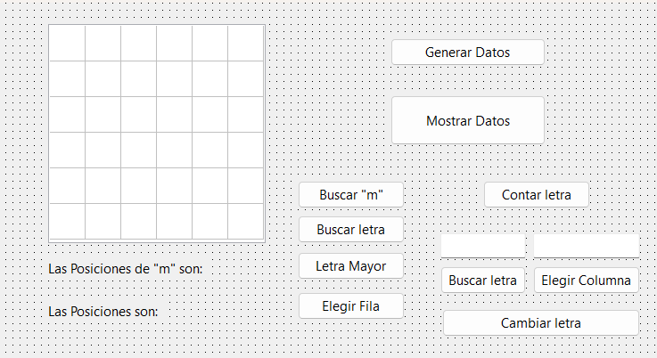

# Pascal: Procesador Algorítmico de Matrices de Caracteres con Interfaz TStringGrid

Este repositorio contiene un proyecto interactivo de escritorio desarrollado en **Pascal** utilizando el entorno **Lazarus / Delphi** enfocado en el manejo de estructuras de datos bidimensionales (*arreglos de dos dimensiones*). La aplicación genera de forma aleatoria una matriz de caracteres de $6 \times 6$ ($\text{base } 0 \dots 5$) mediante codificación ASCII, mapea sus posiciones lógicas sobre un componente visual `TStringGrid`, e implementa múltiples algoritmos de búsqueda, filtrado, mutación de celdas y concatenación de vectores lineales utilizando diferentes estructuras cíclicas de repetición.

---

## 📊 Interfaz Gráfica del Proyecto

Para documentar de forma visual el formulario del sistema, guarda la captura de pantalla de la interfaz en la raíz del repositorio con el nombre exacto de `interfaz_matriz.png`:



---

## ⚙️ Arquitectura Lógica de Algoritmos y Ciclos

El núcleo del archivo `unit1.pas` destaca por aplicar de forma comparativa las tres estructuras clásicas de control de bucles para resolver problemas de búsqueda matricial de tokens:

### 1. Bucle Indexado de Control Estático (`for..to..do`)
Utilizado en la generación aleatoria de datos y en el renderizado de celdas de salida (`btn_mostrarClick`). Permite recorrer filas y columnas mediante variables contadoras deterministas (`f` y `c`):

```pascal
for f := 0 to fil_max do
begin
  for c := 0 to col_max do
  begin
    letra := chr(random(26) + 97); // Generación aleatoria de minúsculas (ASCII 97-122)
    letras[c, f] := letra;
  end;
end;

```

### 2. Bucle Condicional de Entrada (`while..do`)

Implementado en el botón de búsqueda lineal (`btn_letrawhileClick`). Evalúa la condición lógica de límites en la cabecera antes de ejecutar el bloque de código iterativo interno:

```pascal
f := 0;
while f <= fil_max do
begin
  c := 0;
  while c <= col_max do
  begin
    if letras[c, f] = letra_buscar[1] then
      pos_fc := pos_fc + '[' + inttostr(f) + '; ' + inttostr(c) + ']';
    c := c + 1;
  end;
  f := f + 1;
end;

```

### 3. Bucle Condicional de Salida (`repeat..until`)

Implementado en el procedimiento de muestreo repetitivo (`btn_letrarepeatClick`). Garantiza la ejecución de la lógica interna al menos una vez, evaluando la condición de corte por post-condición en la base de la estructura:

```pascal
f := 0;
repeat
  c := 0;
  repeat
    if letras[c, f] = letra_buscar_edt[1] then
      pos_fc := pos_fc + '[' + inttostr(f) + '; ' + inttostr(c) + ']';
    c := c + 1;
  until c > col_max;
  f := f + 1;
until f > fil_max;

```

---

## 📈 Operaciones Especiales de Negocio

El sistema incluye procedimientos dedicados para el análisis multivariable de la matriz:

* **Concatenación Vectorial (Extracción de Filas y Columnas):** Recorre de manera lineal una única coordenada seleccionada por el usuario (`edt_col` o `inputbox`) para unificar los caracteres independientes y formar palabras compuestas.
* **Mutación Genérica de Celda (`UpCase`):** Localiza coordenadas específicas ingresadas de forma dinámica y transforma caracteres minúsculos a mayúsculas mediante mutación directa en memoria del arreglo, refrescando en tiempo real el componente visual `grid_letras`.
* **Análisis de Extremos Relativos (`ord`):** Evalúa el peso decimal ASCII de cada carácter en la matriz utilizando la función nativa `ord()`, aislando cuál es la letra mayor del abecedario presente y reportando un hilo con todas sus ubicaciones idénticas.

---

## 🛠️ Conceptos Técnicos Aplicados

* **Matrices Bidimensionales (`Two-Dimensional Arrays`)**: Estructuras de datos estáticas que reservan un bloque continuo de memoria direccionable mediante dos índices coordenados independientes (Fila y Columna).
* **Mapeo de Interfaces por Celdas (`TStringGrid Mapping`)**: Vinculación lógica bidireccional entre la estructura de datos abstracta residente en memoria RAM (`letras: array`) y la grilla bidimensional de la interfaz gráfica (`grid_letras.cells[c, f]`).
* **Aritmética y Mapeo ASCII**: Uso de funciones de conversión del sistema como `chr()` y `ord()` para traducir enteros decimales en caracteres alfabéticos válidos basándose en el estándar americano de codificación de caracteres.
